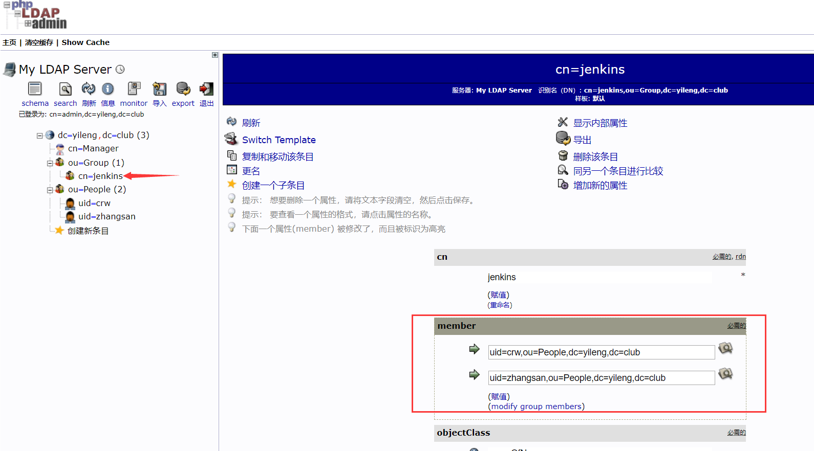

# Jenkins集成ldap

Jenkins启用了ldap登陆之后，默认是登录用户就是管理员权限，尽管我们还可以通过更细化权限划分的插件来实现管控，但是这仍然让人觉得不那么优雅。

因此，在Jenkins这里，打算采用基于应用分组的方式进行配置。

配置之前，首先创建用户以及应用组，那么授权的时候，直接针对应用组授权即可。

创建普通用户：

- 在People之下点击创建新条目
- 模板选择默认
- **ObjectClasses**选择**inetOrgPerson**，然后点击继续
- 从上而下填写，RDN选择 `User Name(uid)`
- 然后开始正式的人员信息填写
  - cn：zhangs
  - sn：zhangs
  - displayName：张三
  - 电子邮件：zhangs@qq.com
  - ou：People
  - 密码：123456
  - User Name：zhangs

然后点击创建，提交之后，一个普通用户就创建成功了。一般情况下，应用直接通过这一层来管理用户即可。

但是有些情况下，再另外拉出来一个分组，从软件的角度来分组，会更好一些。

创建一个应用组：

- 在Group之下创建新条目
- 模板选择默认
- **ObjectClasses**选择**groupOfNames**，然后点击继续
- 从上而下填写，RDN选择 `cn(cn)`
- 然后开始填写组信息
  - cn：jenkins
  - member：点击后边的搜索框，选择将要包含的用户

然后点击创建，提交之后，就创建了一个jenkins组，配置ldap的时候，可以基于这个组来进行管理。

创建完成后的架构模式如下：

可以看到，此时在Jenkins这个组里边，加入了两个用户，实际生产当中，原有用户应该已经存在，此时可以新增群组，然后将需要访问Jenkins应用的用户，加入进来，而没有加入这个组的用户，将无法访问。

下边进入正式配置，新版本的Jenkins已经默认集成了ldap，因此不需要额外安装插件，直接点击`系统管理`—>`Configure Global Security`，按照下边的内容，进行配置即可。
